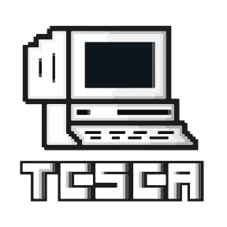

  

# Trent Computer Science Club Association Website

This repository contains the source code for the official website of the Trent University Computer Science Club Association. The website serves as a central hub for club activities, announcements, resources, and information about our club's events.

## Pages

- **[Home](https://tcsca.ca)** - The home page
- **[About Us](https://tcsca.ca/About)** - The about us page
- **[Events](https://tcsca.ca/Events)** - The events page
- **[Contact Us](https://tcsca.ca/Contact)** - The page for our contact us page

## Layout and Structure

- **[pages](pages)** - This folder contains the source code for each page with `_app.tsx` and `_document.tsx` being special files that control global page content.
- **[components](components)** - This folder contains all components for the project
- **[layouts](layouts)** - This folder contains all layouts for the project
- **[styles](styles)** - This folder contains all styles for the project
  - **[components](styles/components)** - This folder contains all styles for the components
  - **[layouts](styles/layouts)** - This folder contains all styles for the layouts
- **[utils.ts](utils.ts)** - This file contains all of our global utility functions

- Additionally, in the root directly you will find a `config.ts` file and `config.yaml` file.
  - `config.ts` is the backbone of our site and ensures type safety for our configuration
  - `config.yaml` is the configuration file for the website

## License

This project is licensed under the [LGPL-2.1 License](LICENSE).

## Commands

- `npm run dev` - Runs the next.js development process
  - if you need to use serverless functions in your testing, run `vercel dev` instead
- `npm run build` - Runs the next.js build process
- `npm run start` - Starts the next.js server in production mode
- `npm run lint` - Runs the linter
- `npm run format` - Runs prettier to format code

## Contributing

We welcome contributions to this project, however, please note that we do have plans and goals, so please contact us before doing anything that heavily impacts UI or functionality. (Fixes always welcome)

## Contact Us

- The best way to contact our devs is via Discord, you can join our Discord server [here](https://discord.gg/serea2sPAd).
- Additionally, you can use the contact us page [here](https://tcsca.ca/Contact).
